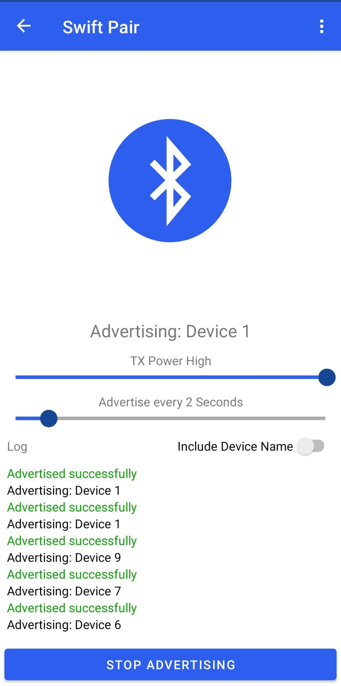
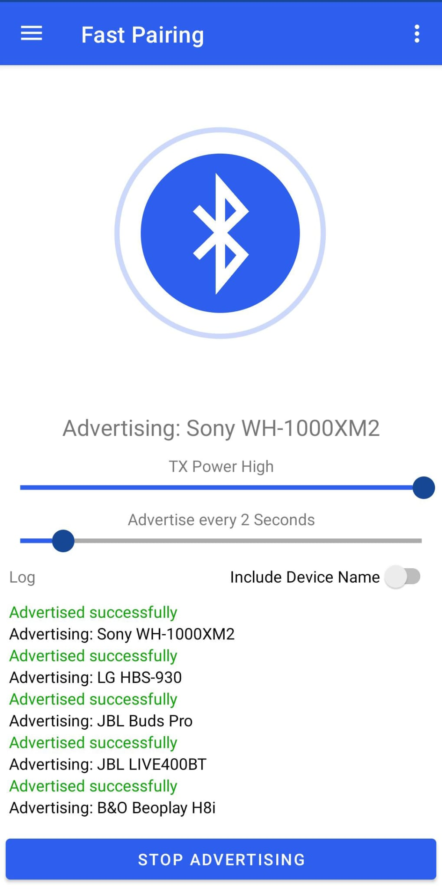
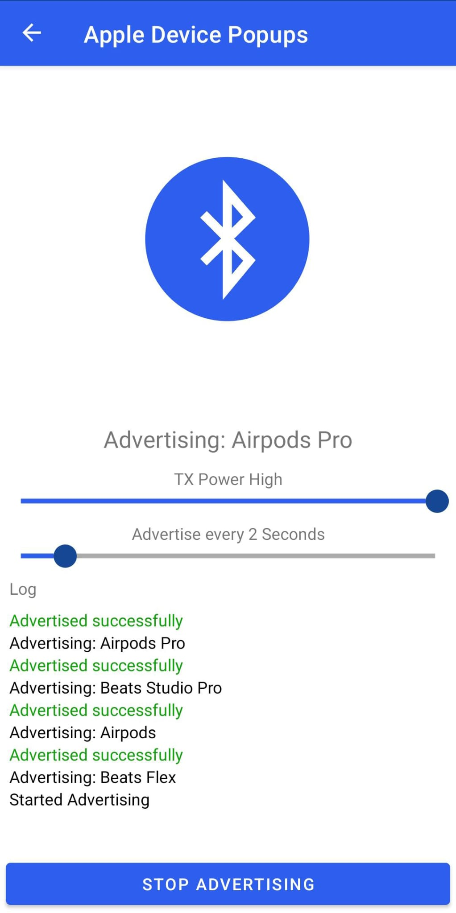

# Bluetooth LE Spam — Custom SwiftPair Fork

[](LICENSE)
[](https://developer.android.com)

A fork of [Bluetooth-LE-Spam](https://github.com/simondankelmann/Bluetooth-LE-Spam) by [@simondankelmann](https://github.com/simondankelmann), extended with **custom SwiftPair payloads** — letting you craft and spam your own Windows SwiftPair Bluetooth advertisements.

---

## What's different from the original?

| Feature | Original | This Fork |
|---------|----------|-----------|
| iOS Continuity spam | ✅ | ✅ |
| Windows Fast Pair spam | ✅ | ✅ |
| Samsung spam | ✅ | ✅ |
| Android spam | ✅ | ✅ |
| **Custom SwiftPair payloads** | ❌ | ✅ |

The key addition is the ability to define your own SwiftPair advertisement data, so you can target specific device names or models instead of using the built-in presets.

---

## Screenshots

| SwiftPair | Fast Pairing | Continuity PopUps |
|-----------|-------------|-------------------|
|  |  |  |

---

## Requirements

- Android device with **Bluetooth LE** support
- Android **6.0+** (API level 23+)
- Android Studio (for building from source)

---

## Build from source

1. Clone the repository:
   ```sh
   git clone https://github.com/messinamirko99-design/custom-swiftpair-spam.git
   cd custom-swiftpair-spam
   ```

2. Open in **Android Studio**

3. Let Gradle sync finish

4. Hit **Run** ▶️ or build an APK via `Build > Build Bundle(s) / APK(s) > Build APK(s)`

---

## Disclaimer

This app is intended for **educational and testing purposes only**. Spamming Bluetooth advertisements at other people's devices without consent may be illegal in your jurisdiction. Use responsibly.

---

## Credits

- Original app: [simondankelmann/Bluetooth-LE-Spam](https://github.com/simondankelmann/Bluetooth-LE-Spam)
- Custom SwiftPair additions: [@messinamirko99-design](https://github.com/messinamirko99-design)
